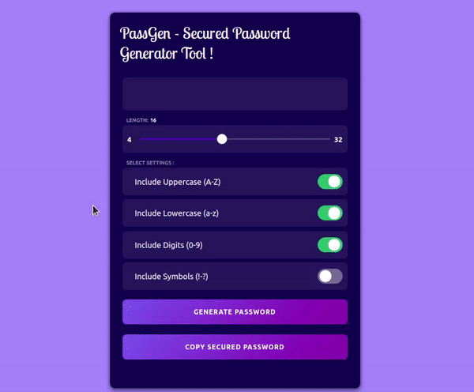

<h1 align="center">🔑 PassGen-Secured Password Generator Tool </h1>

🌟 An easy-to-use , easy-to-generate , secured random password generator 🤩

## * Features:

* [x] Generate secured , randomized passwords 🛡️
* [x] Copy the password to save securely or use for secured authentication 🔗
* [x] Check strength for each password 📶

## * Secured password settings:

* [x] Set length of password (4-32 characters).
* [x] Include uppercase characters 🔠
* [x] Include lowercase characters 🔡
* [x] Include digits 🔢
* [x] Include symbols ❔✅

## * Tech Stack:

* HTML , CSS , JavaScript.

## * Demo :

